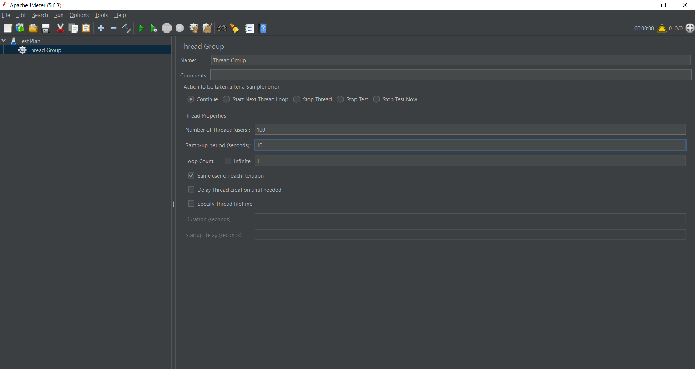
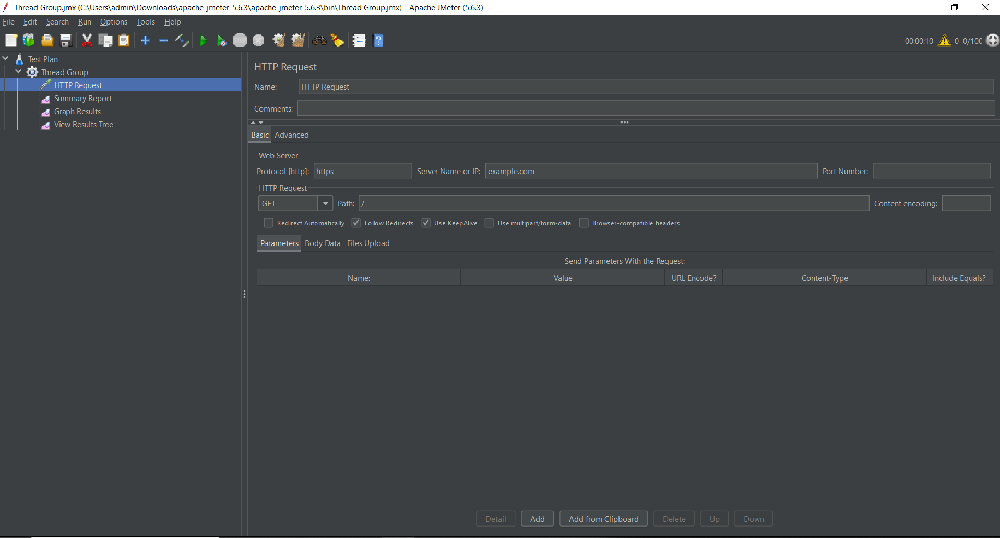
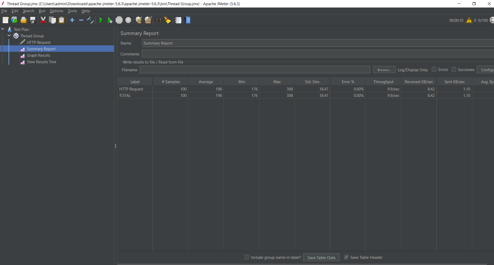
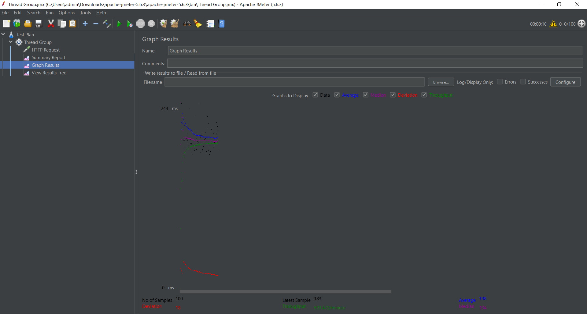

# BÁO CÁO THỰC HÀNH KIỂM THỬ HIỆU NĂNG WEBSITE BẰNG APACHE JMETER

## 1. Giới thiệu

Hiệu năng của một hệ thống web là yếu tố quan trọng ảnh hưởng trực tiếp đến trải nghiệm người dùng. Khi số lượng người truy cập tăng lên, máy chủ cần có khả năng xử lý các yêu cầu một cách ổn định và nhanh chóng. Vì vậy, việc kiểm thử hiệu năng giúp xác định khả năng đáp ứng của hệ thống trước các điều kiện tải khác nhau.

Trong bài thực hành này, công cụ Apache JMeter được sử dụng để mô phỏng 100 người dùng truy cập đồng thời vào website **https://example.com**. Dựa trên kết quả thu được, tiến hành đánh giá tốc độ phản hồi, độ ổn định và khả năng xử lý yêu cầu của hệ thống.

---

## 2. Mục đích thực hiện

Bài thực hành được thực hiện nhằm các mục đích sau:

- Làm quen với công cụ Apache JMeter.
- Xây dựng kịch bản kiểm thử tải cho một website.
- Mô phỏng nhiều người dùng truy cập đồng thời.
- Đo lường các chỉ số hiệu năng của hệ thống.
- Phân tích kết quả và đưa ra nhận xét về khả năng hoạt động của website.

---

## 3. Môi trường kiểm thử

### 3.1 Công cụ sử dụng

- Apache JMeter
- Java Development Kit (JDK)
- Hệ điều hành Windows
- GitHub Repository

### 3.2 Đối tượng kiểm thử

Website được lựa chọn để kiểm thử:

```text
https://example.com
```

Đây là một website mẫu có nội dung tĩnh, thường được sử dụng trong các bài thực hành và kiểm thử cơ bản.

---

## 4. Thiết lập kịch bản kiểm thử

### 4.1 Cấu hình Thread Group

Để mô phỏng lượng người dùng truy cập vào hệ thống, Thread Group được cấu hình như sau:

| Tham số | Giá trị |
|----------|----------|
| Number of Threads | 100 |
| Ramp-Up Period | 10 giây |
| Loop Count | 1 |

Ý nghĩa:

- 100 người dùng ảo được tạo ra.
- Trong vòng 10 giây, toàn bộ người dùng sẽ được khởi động.
- Mỗi người dùng gửi một yêu cầu đến website.

### Hình 1. Thread Group



---

### 4.2 Cấu hình HTTP Request

Thông tin cấu hình yêu cầu HTTP:

| Thuộc tính | Giá trị |
|------------|----------|
| Protocol | HTTPS |
| Server Name | example.com |
| Path | / |
| Method | GET |

Yêu cầu GET được gửi đến trang chủ của website nhằm đo thời gian phản hồi của máy chủ.

### Hình 2. HTTP Request



---

## 5. Thu thập kết quả kiểm thử

Để theo dõi và phân tích kết quả, các Listener sau được sử dụng:

### 5.1 View Results Tree

Listener này cho phép quan sát chi tiết từng request và response.

### Hình 3. View Results Tree


---

### 5.2 Summary Report

Summary Report tổng hợp toàn bộ dữ liệu thống kê trong quá trình kiểm thử.

### Hình 4. Summary Report



---

### 5.3 Graph Results

Graph Results thể hiện dữ liệu dưới dạng đồ thị trực quan giúp dễ dàng đánh giá hiệu năng của hệ thống.

### Hình 5. Graph Results



---

## 6. Kết quả thực nghiệm

Sau khi thực hiện kiểm thử, JMeter ghi nhận các kết quả sau:

| Thông số | Giá trị |
|-----------|----------|
| Tổng số yêu cầu | 100 |
| Thành công | 100 |
| Thất bại | 0 |
| Error Rate | 0.00% |
| Average | 198 ms |
| Median | 194 ms |
| Min | 176 ms |
| Max | 308 ms |
| Std. Dev. | 18.47 ms |
| Throughput | 9.9 requests/sec |
| Received KB/sec | 8.42 |
| Sent KB/sec | 1.10 |

---

## 7. Nhận xét và đánh giá

### 7.1 Khả năng xử lý yêu cầu

Kết quả cho thấy toàn bộ 100 yêu cầu đều được xử lý thành công. Không có bất kỳ lỗi nào xuất hiện trong suốt quá trình kiểm thử.

Điều này chứng tỏ máy chủ có khả năng đáp ứng tốt lượng truy cập được mô phỏng trong bài thực hành.

### 7.2 Tốc độ phản hồi

Thời gian phản hồi trung bình là **198 ms**.

Theo các tiêu chuẩn đánh giá hiệu năng web thông dụng:

- Dưới 200 ms: Rất tốt.
- Từ 200 ms đến 500 ms: Tốt.
- Trên 1000 ms: Cần tối ưu.

Như vậy website đạt mức phản hồi rất nhanh.

### 7.3 Tính ổn định

Độ lệch chuẩn chỉ đạt **18.47 ms**.

Giá trị này cho thấy thời gian xử lý giữa các yêu cầu không có sự dao động lớn, chứng tỏ hệ thống hoạt động ổn định trong suốt quá trình kiểm thử.

### 7.4 Thông lượng hệ thống

Throughput đạt **9.9 yêu cầu mỗi giây**.

Kết quả này phản ánh khả năng xử lý liên tục của máy chủ trong điều kiện tải hiện tại mà không xảy ra hiện tượng nghẽn tài nguyên hoặc giảm hiệu năng.

---

## 8. Hạn chế của bài kiểm thử

Mặc dù đạt kết quả tốt, bài kiểm thử vẫn tồn tại một số hạn chế:

- Chỉ thực hiện trên website có nội dung tĩnh.
- Chưa mô phỏng các chức năng phức tạp như đăng nhập hoặc tìm kiếm.
- Chưa thực hiện kiểm thử với tải lớn hơn.
- Chưa đánh giá khả năng chịu tải dài hạn của hệ thống.

Trong thực tế cần thực hiện thêm các bài kiểm thử tải cao, kiểm thử áp lực và kiểm thử độ bền để có đánh giá toàn diện hơn.

---

## 9. Kết luận

Thông qua việc sử dụng Apache JMeter để kiểm thử hiệu năng website **https://example.com**, có thể thấy hệ thống đáp ứng tốt yêu cầu truy cập đồng thời của người dùng.

Các kết quả đạt được cho thấy:

- Tỷ lệ thành công đạt 100%.
- Không xuất hiện lỗi trong quá trình kiểm thử.
- Thời gian phản hồi nhanh với mức trung bình 198 ms.
- Độ ổn định cao nhờ độ lệch chuẩn thấp.
- Throughput đạt gần 10 yêu cầu mỗi giây.

Từ các kết quả trên có thể kết luận rằng website hoạt động ổn định, phản hồi nhanh và đáp ứng tốt tải kiểm thử được thiết lập trong bài thực hành.

---

